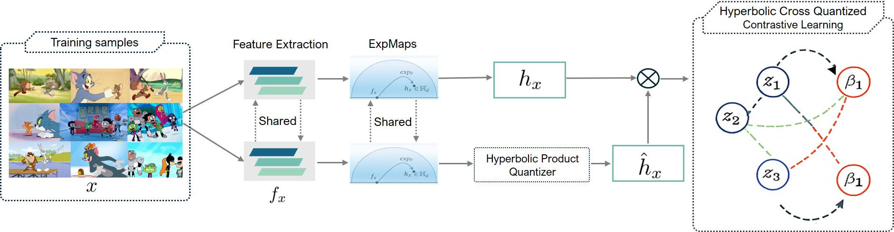

# CQH: Cross-Quantized Hyperbolic Representations for Enhancing Cartoon Image Retrieval

Official PyTorch implementation of **"Cross-Quantized Hyperbolic Representations for Enhancing Cartoon Image Retrieval"** (ACIIDS).

CQH is an unsupervised image-retrieval framework that learns **quantized and continuous representations jointly inside a shared hyperbolic space**. It targets structured, stylized domains such as animation, where hierarchical semantic structure matters for creative workflows. CQH also introduces **Cartoon18K**, the first large-scale cartoon dataset with multi-label hierarchical annotations for unsupervised retrieval.

📄 [Paper](https://lehanhcs.github.io/pdfs/ACIIDS_CQH.pdf)

---

## Highlights

- **Hyperbolic Cross-Quantized Contrastive Learning (HCQC).** Continuous and quantized embeddings are fused in a shared Lorentz manifold. The continuous representation provides a stable, high-fidelity target that guides the quantizer in early training, mitigating the instability seen in prior hyperbolic product quantization. Pulling in samples from the continuous space also alleviates the sampling bias of in-batch negatives.
- **Hierarchical semantics in hyperbolic geometry.** Bottom-up clustering in the tangent space yields multi-level prototypes that are mapped to the hyperbolic product manifold, preserving tree-like semantic relationships.
- **Cartoon18K dataset.** 18,000 keyframes from *Teen Titans Go!*, *Tom & Jerry*, and *Looney Tunes*, manually annotated with multi-labels across 15+ categories (characters, actions, scenes).
- **State-of-the-art results** on Flickr25K, NUS-WIDE, CIFAR-10, plus the new Cartoon18K benchmark.

---

## Method Overview

<p align="center">
  
</p>

Training objective:

```
L = λ1 · L_HCQC + L_HS,    where   L_HS = λ2 · L_proto + λ3 · L_neighbor
```

Distances are computed with the **Lorentzian metric** under a learnable curvature `−θ` per subspace.

---

## Installation

```bash
git clone https://github.com/Greekatz/CQH.git
cd CQH

conda create -n cqh python=3.9 -y
conda activate cqh

# PyTorch (match your CUDA version)
pip install torch torchvision

pip install -r requirements.txt
```

> ⚠️ **TODO:** add a `requirements.txt` (e.g. `numpy`, `scikit-learn`, `geoopt` / Riemannian-SGD dependency, `tqdm`, `Pillow`). Adjust the Python/PyTorch versions to what you actually used.

---

## Datasets

| Dataset      | Images   | Labels                | Query / Train split          |
|--------------|----------|-----------------------|------------------------------|
| Flickr25K    | 25,000   | 24 categories         | 2,000 query / 5,000 train    |
| CIFAR-10 (I) | 60,000   | 10 classes            | 10,000 query / 50,000 train  |
| CIFAR-10 (II)| 60,000   | 10 classes            | 1,000/class query / 500/class train |
| NUS-WIDE     | ~270,000 | 21 frequent categories| 100/class query / 500/class train |
| **Cartoon18K** | 18,000 | 15+ multi-label categories | 2,000 query / 5,000 train |

**Cartoon18K** — 10 YouTube videos across three series (*Teen Titans Go!*, *Tom & Jerry*, *Looney Tunes*), 1,800 keyframes per video, manually annotated with multi-labels. The retrieval database is all non-query images.

📥 **Download:** [Cartoon18K on Kaggle](https://www.kaggle.com/datasets/thanhfhungw1912/cartoon7k5)

> 📦 **TODO:** confirm the expected directory layout after extraction, e.g.:
> ```
> data/
> ├── flickr25k/
> ├── cifar10/
> ├── nuswide/
> └── cartoon18k/
>     ├── images/
>     └── labels/
> ```

---

## Training

```bash
python train.py \
    --dataset cartoon18k \
    --data_dir ./data/cartoon18k \
    --backbone vgg16 \
    --num_codebooks 2 \      # M = 2, 4, 8  ->  16 / 32 / 64 bits
    --codebook_size 256 \    # K codewords per codebook
    --codebook_dim 16 \
    --batch_size 128 \
    --epochs 50 \
    --lr 1e-3 \              # cosine decay to 1e-5
    --optimizer rsgd \      # Riemannian SGD
    --curvature_init 1.0 \
    --tau 0.5 \             # 0.2 for CIFAR-10 (I); see notes
    --lambda2 0.5 \         # CIFAR-10 only
    --lambda3 0.1
```

> ⚠️ **TODO:** replace the flags above with your real argument names. The values come straight from the paper's implementation details.

**Hyperparameter notes (from the paper):**
- Code length is set by `M = 2, 4, 8` → `16, 32, 64` bits, with `K = 256` codewords and dim `16` per codebook.
- `τ = 0.2` for CIFAR-10 (I); `τ = 0.5` for 32/64-bit and `0.2` for 16-bit on CIFAR-10 (II); `τ = 0.5` for Flickr25K, NUS-WIDE, Cartoon18K.
- `λ2 = 0.5` for CIFAR-10; `λ3 = 0.1` for all experiments.
- Augmentations: random crop, horizontal flip, graying, color distortion, Gaussian blur.
- Trained on a single P100 GPU.

---

## Evaluation

```bash
python eval.py \
    --dataset cartoon18k \
    --checkpoint ./checkpoints/cqh_cartoon18k_32bit.pth \
    --bits 32
```

Metric: **Mean Average Precision @ R**. MAP@1000 for CIFAR-10 (I)/(II); MAP@5000 for Flickr25K, NUS-WIDE, Cartoon18K.

> ⚠️ **TODO:** update script/flag names to match your repo.

---

## Results

### MAP (%) on public benchmarks

| Method | Type | Flickr25K (16/32/64) | CIFAR-10 (I) (16/32/64) | CIFAR-10 (II) (16/32/64) | NUS-WIDE (16/32/64) |
|--------|:----:|:---:|:---:|:---:|:---:|
| SPQ    | PQ   | 77.35 / 78.74 / 79.98 | 63.17 / 66.88 / 68.02 | 56.56 / 61.45 / 63.30 | 78.51 / 80.41 / 81.70 |
| HiHPQ  | HPQ  | 80.74 / 80.45 / 80.76 | **72.66** / 72.43 / 70.45 | 63.33 / 65.17 / 66.45 | **80.18** / 81.06 / 81.92 |
| **CQH (Ours)** | HPQ | **81.03 / 81.06 / 82.33** | 71.19 / **73.54 / 72.03** | **63.54 / 66.92 / 68.35** | 79.86 / **81.51 / 82.02** |

### MAP (%) on Cartoon18K

| Method | 16 bits | 32 bits | 64 bits |
|--------|:-------:|:-------:|:-------:|
| **CQH (Ours)** | 79.02 | 77.35 | 77.42 |

CQH also achieves consistently **lower quantization error** than HiHPQ on Flickr25K (32-bit) and converges faster.

---

## Repository Structure

> 🗂️ **TODO:** fill in once finalized.

```
CQH/
├── data/
├── models/
├── datasets/
├── train.py
├── eval.py
├── requirements.txt
└── README.md
```

---

## Citation

If you find this work useful, please cite:

```bibtex
@InProceedings{10.1007/978-981-92-0071-9_26,
  author    = {Nguyen, Thanh-Hung and Le, Thi-Ngoc-Hanh},
  editor    = {Nguyen, Ngoc Thanh and Chen, Chun-Hao and Fujita, Hamido and Hong, Tzung-Pei and Manolopoulos, Yannis and Wojtkiewicz, Krystian},
  title     = {Cross-Quantized Hyperbolic Representations for Enhancing Cartoon Image Retrieval},
  booktitle = {Intelligent Information and Database Systems},
  year      = {2026},
  publisher = {Springer Nature Singapore},
  address   = {Singapore},
  pages     = {384--398},
  isbn      = {978-981-92-0071-9}
}
```

---

## Acknowledgments

This work builds on [HiHPQ](https://github.com/zexuanqiu/hihpq), and our code is based on their implementation. We thank the authors for releasing their code.

---

## Contact

- Thanh-Hung Nguyen — hungnguyenarbeit@gmail.com
- Thi-Ngoc-Hanh Le (corresponding) — ltnhanh@hcmiu.edu.vn

International University, VNU-HCM, Ho Chi Minh City, Vietnam
